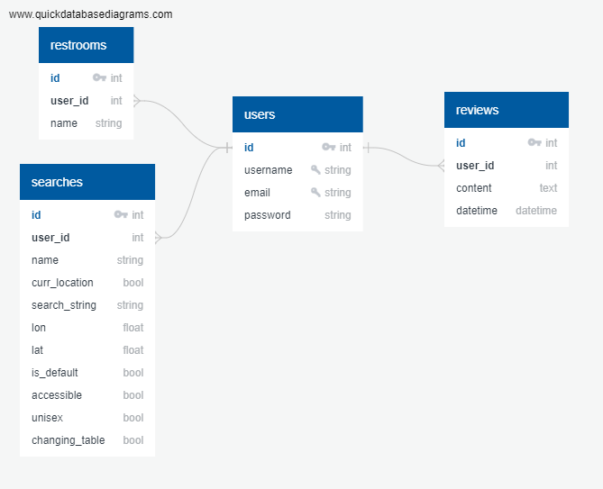

# Restroom Finder
An app which facilitates safe, convenient access to public restrooms.

## Overview

The Restroom Finder application will enable users to search for information about public restrooms near their location, including directions, hours available, accessibility, and unisex bathroom availability. Users will also be able to search for bathrooms updated recently to find current information. 

This app aims to:

- Enable users to find public restrooms
- Facilitate safe restroom access for transgender, intersex, and gender nonconforming individuals
- Assist individuals with disabilities and/or limited mobility to find accessible restrooms
- Present a welcoming, user-friendly interface

The user demographic includes anyone with an internet connection who needs to use a restroom while in public, with special consideration for individuals requiring unisex restrooms, accessible restrooms, and/or changing tables.

## Data Source
Data will be supplied by the [Refuge Restrooms API](https://www.refugerestrooms.org/api/docs/).

## Schema

## Potential Issues
Mapping the search results will require an additional tool, which has yet to be sourced.

This API is crowd-sourced and has occasional duplicate listings, so there may be issues with data integrity.

## Sensitive Information
Passwords will be encrypted. Minimal user information will be collected.

## Functionality
- Save searches or listings for easy recall
- Rate and review listings
- Filter search by: unisex restrooms, accessible restrooms, changing tables, and restrooms that have been updated within a specified timeframe.
- Results displayed in a list or viewable on a map

To protect user identities, and to ensure speedy retrieval when it's needed most, registration will not be required to use the search function.

## User Flow
1. Landing Page - includes a search bar, an option to search by current location, and login/register links.
2. Search Results - lists results by default, with the option to view on a map. Results will include basic information about the listing, with a link to view in detail. If authenticated, user can save a search or an individual location.
3. Listing Detail - shows all available data about a listing, including business hours, notes, and a mini-map. If authenticated, a user can save, rate, or review a listing. 
4. User Profile - displays saved searches and locations, with the ability to edit or delete.

## Stretch Goals
- Feature to provide in-app direction services
